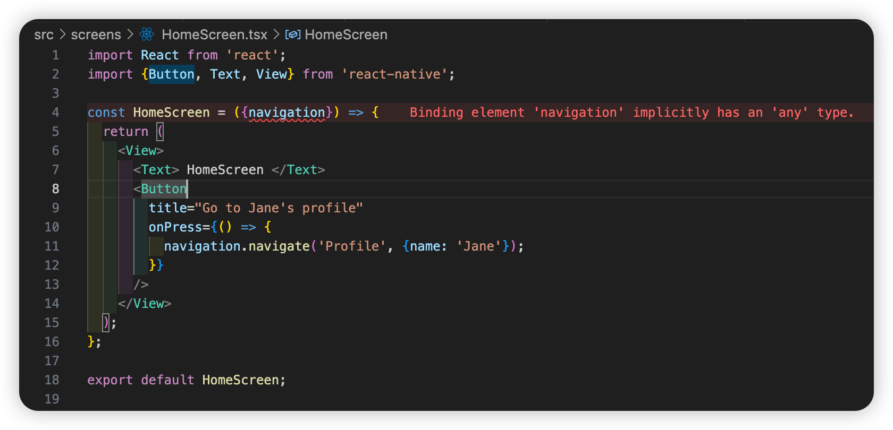
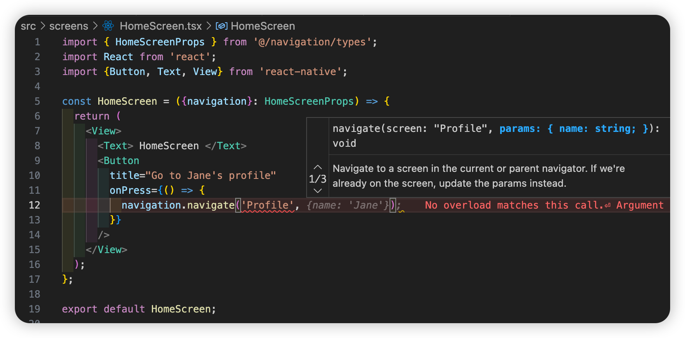
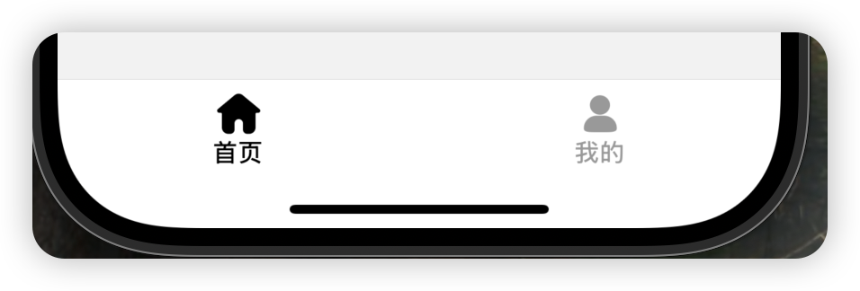
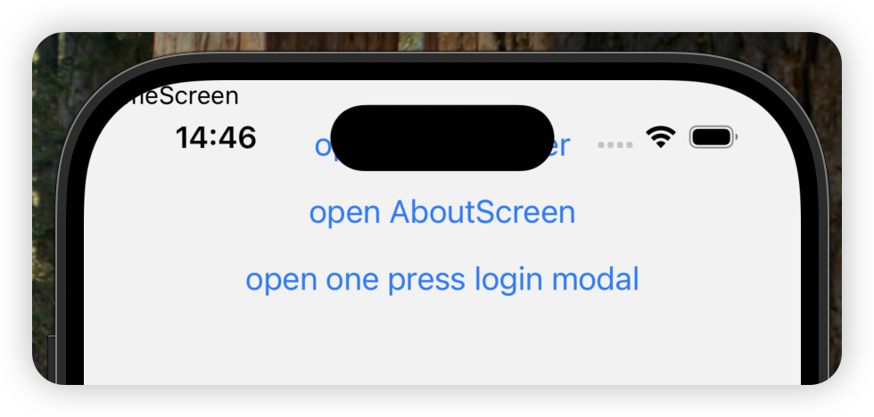
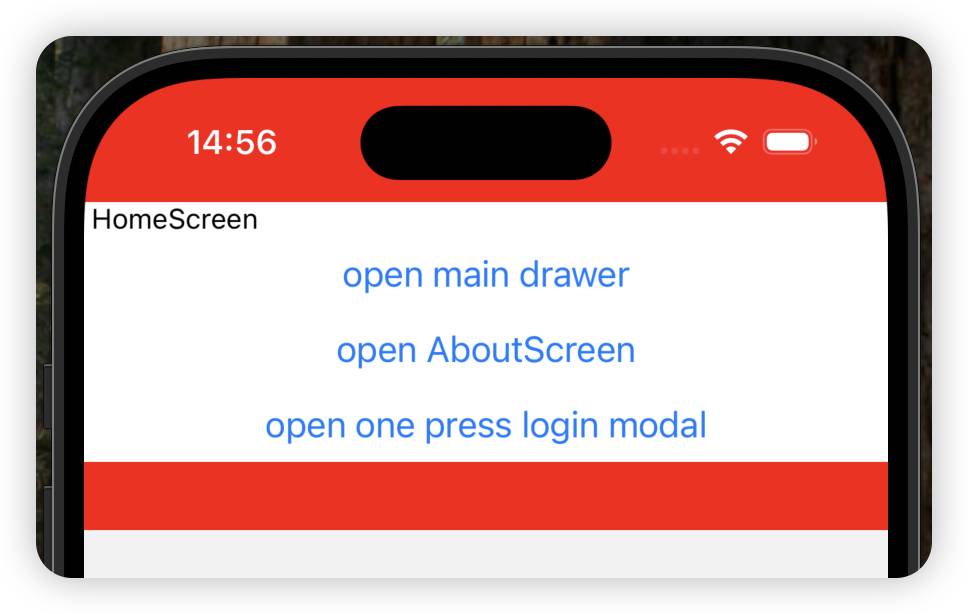
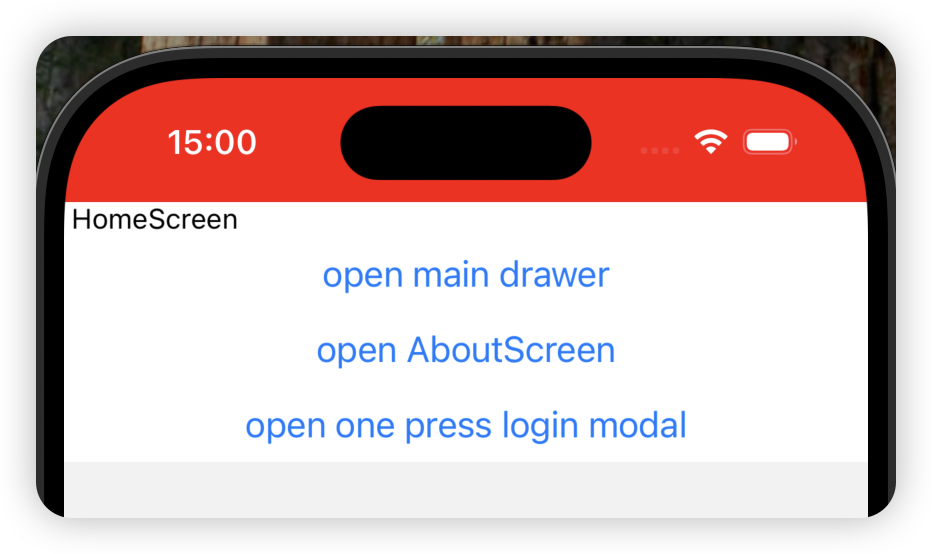

# react-native-template

React Native 开箱即用的基础架构模板

## 路由导航

[React Navigation](https://reactnavigation.org/docs/getting-started)

### 按照 react native 官方文档安装所需依赖

[https://reactnative.dev/docs/navigation](https://reactnative.dev/docs/navigation)

```bash
yarn add @react-navigation/native @react-navigation/native-stack
```

```bash
yarn add react-native-screens react-native-safe-area-context
```

**运行 ios 前，需要先执行**

```bash
cd ios
pod install
cd ..
```

### 修改 App.tsx，创建导航容器

```tsx
import React from 'react';
import {NavigationContainer} from '@react-navigation/native';
import RootStack from '@/navigation';

function App(): React.JSX.Element {
  return (
    <NavigationContainer>
      <RootStack />
    </NavigationContainer>
  );
}

export default App;
```

这里我把 RootStack 放到 navigation 目录下，为了方便管理。

为了使用@作为 src 目录别名，需要安装下面的依赖并做一下配置。

```bash
yarn add --dev babel-plugin-module-resolver
```

在 babel.config.js 文件中添加下面 plugins 配置

```javascript
module.exports = {
  presets: ['module:@react-native/babel-preset'],
  plugins: [
    [
      'module-resolver',
      {
        root: ['./src'],
        alias: {
          '@': './src',
        },
      },
    ],
  ],
};
```

为了让 vscode 能够友好的提示，在 tsconfig.json 文件中新增 compilerOptions 配置

```json
{
  "extends": "@react-native/typescript-config/tsconfig.json",
  "compilerOptions": {
    "baseUrl": ".",
    "paths": {
      "@/*": ["src/*"]
    }
  }
}
```

### 继续完成 RootStack

创建 navigation 模块，导出 RootStack

```tsx
import React from 'react';
import {createNativeStackNavigator} from '@react-navigation/native-stack';
import HomeScreen from '@/screens/HomeScreen';
import ProfileScreen from '@/screens/ProfileScreen';

const Stack = createNativeStackNavigator();

function RootStack() {
  return (
    <Stack.Navigator>
      <Stack.Screen
        name="Home"
        component={HomeScreen}
        options={{title: 'Welcome'}}
      />
      <Stack.Screen name="Profile" component={ProfileScreen} />
    </Stack.Navigator>
  );
}

export default RootStack;
```

创建 HomeScreen、ProfileScreen

```tsx
import React from 'react';
import {Button, Text, View} from 'react-native';

const HomeScreen = ({navigation}) => {
  return (
    <View>
      <Text> HomeScreen </Text>
      <Button
        title="Go to Jane's profile"
        onPress={() => {
          navigation.navigate('Profile', {name: 'Jane'});
        }}
      />
    </View>
  );
};

export default HomeScreen;
```

```tsx
import React from 'react';
import {Text} from 'react-native';

const ProfileScreen = ({route}) => {
  return <Text>This is {route.params.name}'s profile</Text>;
};

export default ProfileScreen;
```

运行查看效果：

> 如果运行 ios，如果安装了原生相关的依赖，都需要再重新运行前，执行一下 ios 相关的命令

```bash
npx pod-install
```

或

```bash
cd ios
pod install
cd ..
```

然后运行 React Native 启动命令

```bash
yarn start
```

建议再开一个终端窗口，执行启动模拟器

```bash
yarn ios
# 或
yarn android
```

最终效果：

<video width="320" height="240" controls>
  <source src="./docs/assets/iShot_2025-02-21_16.13.01.mp4" type="video/mp4">
  Your browser does not support the video tag.
</video>

> 到此已在 App 中完成最基本的路由导航

### 路由导航的 TS 类型

在上面的例子中，发现部分代码的 ts 类型报错




下面继续完善路由导航，添加类型文件

在 navigation 模块下创建 type.ts，导出 RootStackParamList 类型

```ts
// src/navigation/type.ts
import {NativeStackScreenProps} from '@react-navigation/native-stack';

export type RootStackParamList = {
  Home: undefined;
  Profile: {name: string};
};

export type HomeScreenProps = NativeStackScreenProps<
  RootStackParamList,
  'Home'
>;

export type ProfileScreenProps = NativeStackScreenProps<
  RootStackParamList,
  'Profile'
>;

declare global {
  namespace ReactNavigation {
    /**
     * 全局导航参数列表
     */
    interface RootParamList extends RootStackParamList {}
  }
}
```

修改 navigation/index.tsx ，给 createNativeStackNavigator 方法添加 RootStackParamList 类型

```ts
const Stack = createNativeStackNavigator<RootStackParamList>();
```

修改 HomeScreen、ProfileScreen，添加各自的类型

```tsx
const HomeScreen = ({navigation}: HomeScreenProps) => {
  ...
};
```

```tsx
const ProfileScreen = ({route}: ProfileScreenProps) => {
  ...
};
```

现在已经没有了 screen 的 ts 类型报错了，并且在使用导航器的 navigation 和 route 的时候，还会有友好的代码提示。



### Tabs 导航 和 Drawer 导航

一般 app 首页都会有底部 Tabs 导航和 Drawer 导航，下面通过修改前面的代码，将 HomeScreen 和 ProfileScreen 改为 Tabs 导航页面，并添加 Drawer

安装 tabs 导航依赖

```bash
yarn add @react-navigation/bottom-tabs @react-navigation/drawer
```

要使用 @react-navigation/drawer，还需要额外安装下面的依赖

```bash
yarn add react-native-gesture-handler react-native-reanimated
```

创建首页底部 Tabs 导航

创建下面页面，并把之前的 HomeScreen 和 ProfileScreen 移动到 HomeTabs 目录下

```tsx
// src/screen/HomeTabs/index.tsx
import React from 'react';
import {createBottomTabNavigator} from '@react-navigation/bottom-tabs';
import HomeScreen from './HomeScreen';
import ProfileScreen from './ProfileScreen';
import {HomeTabsParamList} from '@/navigation/types';

const BottomTabNavigator = createBottomTabNavigator<HomeTabsParamList>();

const HomeTabs = () => {
  return (
    <BottomTabNavigator.Navigator initialRouteName="Home">
      <BottomTabNavigator.Screen
        name="Home"
        component={HomeScreen}
        options={{title: '首页'}}
      />
      <BottomTabNavigator.Screen
        name="Profile"
        component={ProfileScreen}
        options={{title: '我的'}}
      />
    </BottomTabNavigator.Navigator>
  );
};

export default HomeTabs;
```

修改导航根节点

```jsx
import React from 'react';
import {createNativeStackNavigator} from '@react-navigation/native-stack';
import {RootStackParamList, RoowDrawerStackParamList} from './types';
import HomeTabs from '../screens/HomeTabs/index';
import {createDrawerNavigator} from '@react-navigation/drawer';
import AboutScreen from '@/screens/Settings/AboutScreen';

const Stack = createNativeStackNavigator<RootStackParamList>();
const RootDrawerStack = createDrawerNavigator<RoowDrawerStackParamList>();

function RootStack() {
  return (
    <Stack.Navigator>
      <Stack.Screen name="HomeTabs" component={HomeTabs} />
      <Stack.Group>
        <Stack.Screen name="About" component={AboutScreen} />
      </Stack.Group>
    </Stack.Navigator>
  );
}

function RootDrawerWrapper() {
  return (
    <RootDrawerStack.Navigator>
      <RootDrawerStack.Screen name="MainDrawer" component={RootStack} />
    </RootDrawerStack.Navigator>
  );
}

export default RootDrawerWrapper;
```

此处新增了一个 About 页面

```jsx
import {AboutScreenProps} from '@/navigation/types';
import {Text, View, Button} from 'react-native';

const AboutScreen = ({navigation}: AboutScreenProps) => {
  return (
    <View>
      <Text> AboutScreen </Text>

      <Button
        title="open main drawer"
        onPress={() => {
          navigation.openDrawer();
        }}
      />
    </View>
  );
};

export default AboutScreen;
```

修改 navigation 的类型文件

```ts
import {BottomTabScreenProps} from '@react-navigation/bottom-tabs';
import {DrawerScreenProps} from '@react-navigation/drawer';
import {
  CompositeScreenProps,
  NavigatorScreenParams,
} from '@react-navigation/native';
import {NativeStackScreenProps} from '@react-navigation/native-stack';

/**
 * 根堆栈导航的参数列表类型
 * @typedef RootStackParamList
 * @property {NavigatorScreenParams<HomeTabsParamList>} HomeTabs - 主页标签页导航参数
 * @property {undefined} About - 关于页面
 */
export type RootStackParamList = {
  HomeTabs: NavigatorScreenParams<HomeTabsParamList>;
  About: undefined;
};

/**
 * 根抽屉导航的参数列表类型
 * @typedef RoowDrawerStackParamList
 * @property {undefined} MainDrawer - 主抽屉页面
 */
export type RoowDrawerStackParamList = {
  MainDrawer: undefined;
};

/**
 * 根堆栈屏幕属性类型
 * 组合了原生堆栈导航属性和抽屉导航属性
 * @template T - 根堆栈参数列表中的键
 */
export type RootStackScreenProps<T extends keyof RootStackParamList> =
  CompositeScreenProps<
    NativeStackScreenProps<RootStackParamList, T>,
    DrawerScreenProps<RoowDrawerStackParamList>
  >;

/**
 * 主页标签页导航的参数列表类型
 * @typedef HomeTabsParamList
 * @property {undefined} Home - 主页
 * @property {undefined} Profile - 个人资料页
 */
export type HomeTabsParamList = {
  Home: undefined;
  Profile: undefined;
};

/**
 * 主页屏幕属性类型
 * 组合了底部标签页导航属性和根堆栈导航属性
 */
export type HomeScreenProps = CompositeScreenProps<
  BottomTabScreenProps<HomeTabsParamList, 'Home'>,
  RootStackScreenProps<'HomeTabs'>
>;

/**
 * 个人资料页屏幕属性类型
 * 组合了底部标签页导航属性和根堆栈导航属性
 */
export type ProfileScreenProps = CompositeScreenProps<
  BottomTabScreenProps<HomeTabsParamList, 'Profile'>,
  RootStackScreenProps<'HomeTabs'>
>;

/**
 * 关于页面的屏幕属性类型
 */
export type AboutScreenProps = RootStackScreenProps<'About'>;

declare global {
  namespace ReactNavigation {
    /**
     * 全局导航参数列表
     */
    interface RootParamList extends RootStackParamList {}
  }
}
```

运行后的效果展示：

<video width="320" height="240" controls>
  <source src="./docs/assets/iShot_2025-02-26_16.43.55.mp4" type="video/mp4">
  Your browser does not support the video tag.
</video>

### Modal 导航

业务场景中场景的模态框，比如登录的弹窗

在 react-navigation 中，模态框的创建跟普通页面一致

只需要在 screenOptions 里设置 presentation 属性

```tsx
<Stack.Group screenOptions={{presentation: 'modal'}}>
  <Stack.Screen name="MyModal" component={ModalScreen} />
</Stack.Group>
```

下面我们来创建一个登录的模态框效果

```tsx
// screens/Login/OnePressLoginModal.tsx
import {OnePressLoginModalProps} from '@/navigation/types';
import {Button, StyleSheet, TouchableWithoutFeedback, View} from 'react-native';

const OnePressLoginModal = ({navigation}: OnePressLoginModalProps) => {
  return (
    <View style={styles.container}>
      <TouchableWithoutFeedback
        onPress={() => {
          navigation.goBack();
        }}>
        <View style={styles.mask} />
      </TouchableWithoutFeedback>

      <View style={styles.modal}>
        <Button
          title="一键登录"
          onPress={() => {
            console.log('一键登录');
          }}
        />
      </View>
    </View>
  );
};

const styles = StyleSheet.create({
  container: {
    flex: 1,
    justifyContent: 'flex-end',
  },
  mask: {
    ...StyleSheet.absoluteFillObject,
    backgroundColor: 'rgba(0, 0, 0, 0.5)',
  },
  modal: {
    backgroundColor: 'white',
    borderTopLeftRadius: 20,
    borderTopRightRadius: 20,
    padding: 16,
    height: '40%',
    justifyContent: 'center',
    alignItems: 'center',
  },
});

export default OnePressLoginModal;
```

在根节点导航器内添加 OnePressLoginModal

```tsx
function RootStack() {
  return (
    <Stack.Navigator>
      <Stack.Screen name="HomeTabs" component={HomeTabs} />
      <Stack.Group>
        <Stack.Screen name="About" component={AboutScreen} />
      </Stack.Group>
      <Stack.Group
        screenOptions={{
          presentation: 'transparentModal',
          headerShown: false,
          animation: 'fade_from_bottom',
        }}>
        <Stack.Screen
          name="OnePressLoginModal"
          component={OnePressLoginModal}
          options={{
            contentStyle: {backgroundColor: 'transparent'},
          }}
        />
      </Stack.Group>
    </Stack.Navigator>
  );
}
```

在首页添加按钮，触发跳转

```tsx
<Button
  title="open one press login modal"
  onPress={() => {
    navigation.navigate('OnePressLoginModal');
  }}
/>
```

最终效果：

<video width="320" height="240" controls>
  <source src="./docs/assets/iShot_2025-02-26_17.45.14.mp4" type="video/mp4">
  Your browser does not support the video tag.
</video>

导航章节结束

## 美化导航

### 使用 iconfont 图标库，为底部 tab 导航添加图标

安装必要的依赖：

```bash
yarn add react-native-svg
```

图标转换工具：

```bash
yarn add -D react-native-iconfont-cli-2
```

react-native-iconfont-cli-2 是我 fork [react-native-iconfont-cli](https://github.com/iconfont-cli/react-native-iconfont-cli) 做的修改

react-native-iconfont-cli 好像已经没维护了，当前版本会出现 defaultProps 的报错

所以自己 fork 做了修复并发布为 [react-native-iconfont-cli-2](https://github.com/ace0109/react-native-iconfont-cli)

初始化和使用方式与 react-native-iconfont-cli 一致。

### 修改底部 tab 导航图标与样式

在之前的代码中修改 HomeTabs 代码，添加 screenOptions 参数

```tsx
import {createBottomTabNavigator} from '@react-navigation/bottom-tabs';
import HomeScreen from './HomeScreen';
import ProfileScreen from './ProfileScreen';
import {HomeTabsParamList} from '@/navigation/types';
import {RouteProp} from '@react-navigation/native';
import {IconHome, IconProfile} from '@/components/Iconfont';

const BottomTabNavigator = createBottomTabNavigator<HomeTabsParamList>();

const HomeTabs = () => {
  return (
    <BottomTabNavigator.Navigator
      initialRouteName="Home"
      screenOptions={({route}) => {
        return {
          headerShown: false, // 隐藏头部
          tabBarActiveTintColor: '#000', // 选中颜色
          tabBarInactiveTintColor: '#999', // 未选中颜色
          tabBarActiveBackgroundColor: '#fff', // 选中背景色
          tabBarInactiveBackgroundColor: '#fff', // 未选中背景色
          tabBarLabelStyle: {
            fontSize: 14,
          },
          tabBarIcon: getTabBarIcon(route),
        };
      }}>
      <BottomTabNavigator.Screen
        name="Home"
        component={HomeScreen}
        options={{title: '首页'}}
      />
      <BottomTabNavigator.Screen
        name="Profile"
        component={ProfileScreen}
        options={{title: '我的'}}
      />
    </BottomTabNavigator.Navigator>
  );
};

const getTabBarIcon =
  (route: RouteProp<HomeTabsParamList, keyof HomeTabsParamList>) =>
  (props: {focused: boolean; color: string; size: number}) => {
    switch (route.name) {
      case 'Home':
        return <IconHome color={props.color} size={24} />;
      case 'Profile':
        return <IconProfile color={props.color} size={24} />;
      default:
        return null;
    }
  };

export default HomeTabs;
```

效果：



### 优化刘海屏和底部小白条

当我们给 screenOptions 设置 headerShown: false 后



我们需要给页面做兼容处理

我们前面已经有安装了所需依赖：

[react-native-safe-area-context](https://appandflow.github.io/react-native-safe-area-context/)

先给 app.tsx 加一层 SafeAreaProvider

```tsx
import React from 'react';
import {NavigationContainer} from '@react-navigation/native';
import RootStack from '@/navigation';
import {SafeAreaProvider} from 'react-native-safe-area-context';

function App(): React.JSX.Element {
  return (
    <SafeAreaProvider>
      <NavigationContainer>
        <RootStack />
      </NavigationContainer>
    </SafeAreaProvider>
  );
}

export default App;
```

然后在需要兼容的页面，加上一层 SafeAreaView

```tsx
import {HomeScreenProps} from '@/navigation/types';
import {Button, StyleSheet, Text, View} from 'react-native';
import {SafeAreaView} from 'react-native-safe-area-context';

const HomeScreen = ({navigation}: HomeScreenProps) => {
  return (
    <SafeAreaView style={styles.container}>
      <View style={styles.content}>
        <Text> HomeScreen </Text>
        <Button
          title="open main drawer"
          onPress={() => {
            navigation.openDrawer();
          }}
        />

        <Button
          title="open AboutScreen"
          onPress={() => {
            navigation.navigate('About');
          }}
        />

        <Button
          title="open one press login modal"
          onPress={() => {
            navigation.navigate('OnePressLoginModal');
          }}
        />
      </View>
    </SafeAreaView>
  );
};

const styles = StyleSheet.create({
  container: {
    backgroundColor: 'red',
  },
  content: {
    backgroundColor: '#fff',
  },
});

export default HomeScreen;
```

现在看刚刚的首页效果：



我们给容器加上背景后，可以看到上下默认都有做了间距处理

默认是使用 padding，也可以通过 mode 参数修改为 margin

在 tab 页面，底部已经由 tabBar 处理了，所以我们的容器不需要再处理底部的间距

通过 edges 参数，控制需要的方向

```tsx
<SafeAreaView style={styles.container} edges={['top']}>
```

效果：



## 屏幕尺寸适配

在 web 开发中，我们会使用 px2rem 或者 px2viewport 来做不同尺寸屏幕的适配

在 react native 中，可以使用 [react-native-size-matters](https://github.com/nirsky/react-native-size-matters)

安装依赖：

```bash
yarn add react-native-size-matters
```

默认使用的换算尺寸为 350dp x 680dp，我们可以通过配置改变换算的尺寸，假设 UI 设计稿尺寸为 390

安装依赖：

```bash
yarn add -D babel-plugin-dotenv-import
```

修改 babel.config.js，在 plugins 里添加 dotenv-import 配置

```js
module.exports = {
  presets: ['module:@react-native/babel-preset'],
  plugins: [
    [
      'module-resolver',
      {
        root: ['./src'],
        alias: {
          '@': './src',
        },
      },
    ],
    'react-native-reanimated/plugin',
    [
      'dotenv-import',
      {
        moduleName: '@env',
        path: '.env',
      },
    ],
  ],
};
```

在根目录创建.env 文件

```
SIZE_MATTERS_BASE_WIDTH=390
SIZE_MATTERS_BASE_HEIGHT=844
```

创建全局类型目录 types，创建一个 env.d.ts，后续新增了环境变量方便使用类型提示

```ts
declare module '@env' {
  export const SIZE_MATTERS_BASE_WIDTH: number;
  export const SIZE_MATTERS_BASE_HEIGHT: number;
}
```

尝试在页面输出一下环境变量，读取到就 ok 了

```tsx
import {SIZE_MATTERS_BASE_WIDTH, SIZE_MATTERS_BASE_HEIGHT} from '@env';

...
<Text> SIZE_MATTERS_BASE_WIDTH: {SIZE_MATTERS_BASE_WIDTH} </Text>
<Text> SIZE_MATTERS_BASE_HEIGHT: {SIZE_MATTERS_BASE_HEIGHT} </Text>
...
```

使用了自定义尺寸后，需要从 react-native-size-matters/extend 引入方法

```ts
import {ScaledSheet} from 'react-native-size-matters/extend';
```

修改首页使用示例：

```tsx
import {HomeScreenProps} from '@/navigation/types';
import {Button, Text, View} from 'react-native';
import {SafeAreaView} from 'react-native-safe-area-context';
import {API_URL} from '@env';
import {scale, ScaledSheet} from 'react-native-size-matters/extend';

const HomeScreen = ({navigation}: HomeScreenProps) => {
  return (
    <SafeAreaView style={styles.container} edges={['top']}>
      <View style={styles.content}>
        <Text style={{fontSize: scale(16)}}> HomeScreen {API_URL} </Text>
        <Button
          title="open main drawer"
          onPress={() => {
            navigation.openDrawer();
          }}
        />

        <Button
          title="open AboutScreen"
          onPress={() => {
            navigation.navigate('About');
          }}
        />

        <Button
          title="open one press login modal"
          onPress={() => {
            navigation.navigate('OnePressLoginModal');
          }}
        />
      </View>
    </SafeAreaView>
  );
};

const styles = ScaledSheet.create({
  container: {
    backgroundColor: 'red',
  },
  content: {
    backgroundColor: '#fff',
    fontSize: '20@s',
  },
});

export default HomeScreen;
```

## 本地缓存

[react-native-mmkv](https://github.com/mrousavy/react-native-mmkv)

```bash
yarn add react-native-mmkv
```

使用

```ts
import {MMKV, Mode} from 'react-native-mmkv';

export const storage = new MMKV({
  id: `user-${userId}-storage`,
  path: `${USER_DIRECTORY}/storage`,
  encryptionKey: 'hunter2',
  mode: Mode.MULTI_PROCESS,
  readOnly: false,
});
```

我们创建一个 storage 模块，用来管理本地缓存

```ts
// src/storage/modules/userStorage.ts
import {MMKV} from 'react-native-mmkv';
import {ENCRYPTION_KEY} from '@env';

export const userStorage = new MMKV({
  id: 'user-storage',
  encryptionKey: ENCRYPTION_KEY,
});
```

创建一个入口文件导出

```ts
// src/storage/index.ts
export * from './modules/userStorage';
```

修改首页查看效果：

```tsx
import {HomeScreenProps} from '@/navigation/types';
import {Button, Text, View} from 'react-native';
import {SafeAreaView} from 'react-native-safe-area-context';
import {API_URL} from '@env';
import {scale, ScaledSheet} from 'react-native-size-matters/extend';
import {userStorage} from '@/storage';
import {useMMKVString} from 'react-native-mmkv';

const HomeScreen = ({}: HomeScreenProps) => {
  // const token = userStorage.getString('token');
  const [token, setToken] = useMMKVString('token', userStorage);

  return (
    <SafeAreaView style={styles.container} edges={['top']}>
      <View style={styles.content}>
        <Text style={{fontSize: scale(16)}}> HomeScreen {API_URL} </Text>
        <Button
          title="set user token"
          onPress={() => {
            // userStorage.set('token', '123456');
            setToken('6789');
          }}
        />

        <Text>token: {token || '-'}</Text>
      </View>
    </SafeAreaView>
  );
};

const styles = ScaledSheet.create({
  container: {
    backgroundColor: 'red',
  },
  content: {
    backgroundColor: '#fff',
    fontSize: '20@s',
  },
});

export default HomeScreen;
```

## 全局状态管理 [zustand](https://github.com/pmndrs/zustand)

```bash
yarn add zustand
```

将全局状态管理 zustand 与 本地缓存 react-native-mmkv 配合完成状态持久化

创建以下文件：

```ts
import {userStorage} from '@/storage/index';
import {create} from 'zustand';
import {persist, createJSONStorage} from 'zustand/middleware';

interface UserInfo {
  userId: string;
  username: string;
}

interface UserState {
  userInfo: UserInfo | null;
  token: string | null;
  setUserInfo: (userInfo: UserInfo) => void;
  setToken: (token: string) => void;
}

export const userStore = create<UserState>()(
  persist(
    set => ({
      userInfo: null,
      token: null,
      setUserInfo: (userInfo: UserInfo) => {
        set(() => {
          return {
            userInfo,
          };
        });
      },
      setToken: token =>
        set(() => {
          return {
            token,
          };
        }),
    }),
    {
      name: 'user-storage',
      storage: createJSONStorage(() => ({
        setItem: (key: string, value: any) => {
          return userStorage.set(key, value);
        },
        getItem: (key: string) => {
          const value = userStorage.getString(key);
          return value ?? null;
        },
        removeItem: (key: string) => {
          return userStorage.delete(key);
        },
      })),
    },
  ),
);
```

修改首页演示效果

```tsx
import {HomeScreenProps} from '@/navigation/types';
import {Button, Text, View} from 'react-native';
import {SafeAreaView} from 'react-native-safe-area-context';
import {API_URL} from '@env';
import {scale, ScaledSheet} from 'react-native-size-matters/extend';
import {userStore} from '@/store';

const HomeScreen = ({}: HomeScreenProps) => {
  const {userInfo, setUserInfo, token, setToken} = userStore();

  return (
    <SafeAreaView style={styles.container} edges={['top']}>
      <View style={styles.content}>
        <Text style={{fontSize: scale(16)}}> HomeScreen {API_URL} </Text>
        <Button
          title="set user token"
          onPress={() => {
            // userStorage.set('token', '123456');
            setToken('6789');
          }}
        />

        <Text>token: {token || '-'}</Text>

        <Button
          title="set user info"
          onPress={() => {
            const randomId = Math.random().toString(36).substring(2, 11);
            const names = [
              'Alice',
              'Bob',
              'Charlie',
              'David',
              'Eva',
              'Frank',
              'Grace',
            ];
            const randomName = names[Math.floor(Math.random() * names.length)];
            setUserInfo({userId: randomId, username: randomName});
          }}
        />

        <Text>user id: {userInfo?.userId || '-'}</Text>
        <Text>user name: {userInfo?.username || '-'}</Text>
      </View>
    </SafeAreaView>
  );
};

const styles = ScaledSheet.create({
  container: {
    backgroundColor: 'red',
  },
  content: {
    backgroundColor: '#fff',
    fontSize: '20@s',
  },
});

export default HomeScreen;
```

## useState 的替代 [jotai](https://github.com/pmndrs/jotai)

jotai 可以用来做全局状态管理，但是我只是用来代替 useState

为什么选择 jotai，主要有 3 个原因：

1. 类似于 vue 的 computed
2. 异步更新
3. 深层次的对象更新

- computed

```tsx
import {HomeScreenProps} from '@/navigation/types';
import {Button, Text, View} from 'react-native';
import {SafeAreaView} from 'react-native-safe-area-context';
import {ScaledSheet} from 'react-native-size-matters/extend';
import {atom, useAtom} from 'jotai';

const countAtom = atom(0);
const doubledCountAtom = atom(get => get(countAtom) * 2);

const HomeScreen = ({navigation}: HomeScreenProps) => {
  const [count, setCount] = useAtom(countAtom);
  const [doubledCount] = useAtom(doubledCountAtom);

  return (
    <SafeAreaView style={styles.container} edges={['top']}>
      <View style={styles.content}>
        <Text>count: {count}</Text>
        <Text>doubled count: {doubledCount}</Text>
        <Button title="one up" onPress={() => setCount(c => c + 1)} />

        <Button
          title="open about"
          onPress={() => navigation.navigate('About')}
        />
      </View>
    </SafeAreaView>
  );
};

const styles = ScaledSheet.create({
  container: {
    backgroundColor: 'red',
  },
  content: {
    backgroundColor: '#fff',
    fontSize: '20@s',
  },
});

export default HomeScreen;
```

- 异步更新

```tsx
import {HomeScreenProps} from '@/navigation/types';
import {Button, Text, View} from 'react-native';
import {SafeAreaView} from 'react-native-safe-area-context';
import {ScaledSheet} from 'react-native-size-matters/extend';
import {atom, useAtom} from 'jotai';
import {Suspense} from 'react';

const countAtom = atom(0);
const asyncAtom = atom(async get => {
  return new Promise<number>(resolve => {
    setTimeout(() => {
      resolve(get(countAtom) * 2);
    }, 1000);
  });
});

function AsyncAtomComponent() {
  const [asyncValue] = useAtom(asyncAtom);

  return (
    <>
      <Text>async count: {asyncValue}</Text>
    </>
  );
}

const HomeScreen = ({navigation}: HomeScreenProps) => {
  const [count, setCount] = useAtom(countAtom);

  return (
    <SafeAreaView style={styles.container} edges={['top']}>
      <View style={styles.content}>
        <Text>count: {count}</Text>
        <Suspense fallback={<Text>Loading...</Text>}>
          <AsyncAtomComponent />
        </Suspense>
        <Button title="one up" onPress={() => setCount(c => c + 1)} />

        <Button
          title="open about"
          onPress={() => navigation.navigate('About')}
        />
      </View>
    </SafeAreaView>
  );
};

const styles = ScaledSheet.create({
  container: {
    backgroundColor: 'red',
  },
  content: {
    backgroundColor: '#fff',
    fontSize: '20@s',
  },
});

export default HomeScreen;
```

- 深层次的对象更新

需要额外安装 2 个依赖：

```bash
yarn add immer jotai-immer
```

```tsx
import {HomeScreenProps} from '@/navigation/types';
import {Button, Text, View} from 'react-native';
import {SafeAreaView} from 'react-native-safe-area-context';
import {ScaledSheet} from 'react-native-size-matters/extend';
import {useAtom} from 'jotai';
import {atomWithImmer} from 'jotai-immer';

const userAtom = atomWithImmer({
  name: 'John',
  profile: {
    address: {
      city: 'Shanghai',
    },
  },
});

const HomeScreen = ({}: HomeScreenProps) => {
  const [user, setUser] = useAtom(userAtom);

  return (
    <SafeAreaView style={styles.container} edges={['top']}>
      <View style={styles.content}>
        <Text>{JSON.stringify(user)}</Text>

        <Button
          title="updateUser"
          onPress={() => {
            setUser(draft => {
              draft.name = 'Lai';
              draft.profile.address.city = 'Beijing';
            });

            // 如果是useState的话
            // setUser(prevState => {
            //   return {
            //     ...prevState,
            //     profile: {
            //       ...prevState.profile,
            //       address: {
            //         ...prevState.profile.address,
            //         city: newCity,
            //       },
            //     },
            //   };
            // });
          }}
        />
      </View>
    </SafeAreaView>
  );
};

const styles = ScaledSheet.create({
  container: {
    backgroundColor: 'red',
  },
  content: {
    backgroundColor: '#fff',
    fontSize: '20@s',
  },
});

export default HomeScreen;
```
